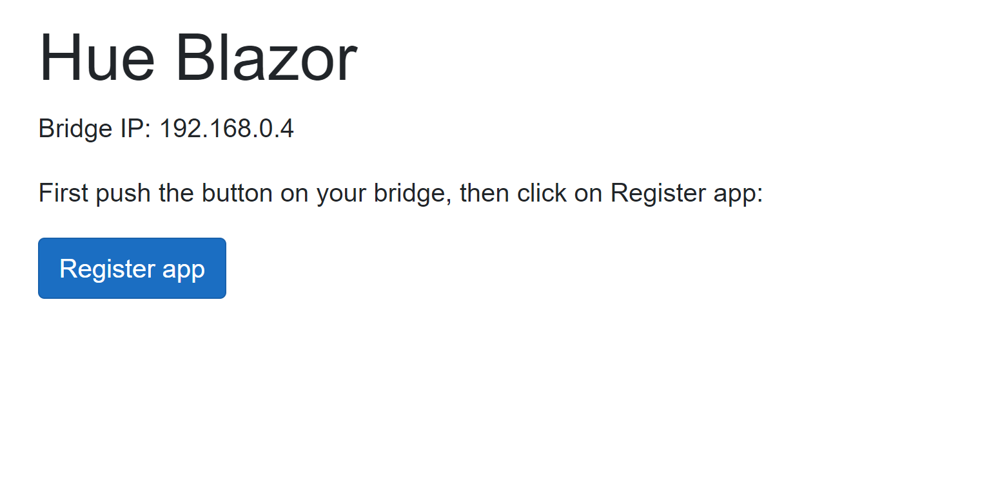
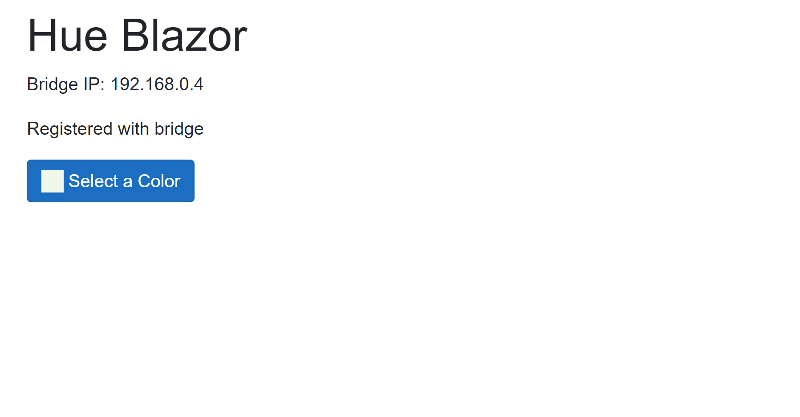
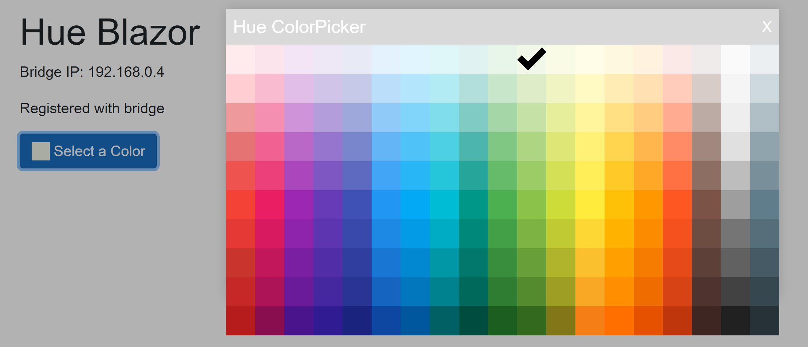

# Hue.Blazor
Blazor WebAssembly application to control your Hue lamps.

## Live demo: http://github-hueblazor.michielpost.nl

Current state: proof of concept

Features:
- Detect the bridge IP address
- Register the app 
- Change the color of the lamps.

NOTE: This app only runs on HTTP, because the Hue Bridge does not have a valid SSL certificate.

## Screenshots

## Dependencies

Blazor-Color-Picker  
https://github.com/tossnet/Blazor-Color-Picker

Blazored.LocalStorage  
https://github.com/Blazored/LocalStorage

Q42.HueApi  
https://github.com/Q42/Q42.HueApi